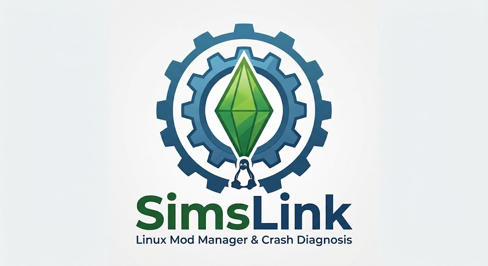

<div align="center">
  

**A Linux-native mod manager for The Sims 4.**

[](LICENSE)
[](#)
[](#)
[](#)

</div>

---

## Why SimsLink

There is no official CurseForge Mod Manager for Linux — the official client is Windows-only. Players on Linux (via Steam/Proton, Lutris, or native setups) have had to manage mods by hand: manual downloads, manual unzipping, manual folder placement, and no help at all when the game crashes.

SimsLink exists to close that gap, with one thing most mod managers don't attempt at all: **figuring out which mod actually broke your game.** It reads the game's own exception log, cross-references it against your installed mods, and — when the log alone isn't enough — walks you through an automated binary-search process to isolate the culprit.

It's a personal, non-commercial, open-source project, built around respect for how the game actually loads mods and for how mod authors have chosen to distribute their work.

## Features

- **Local mod library** — a dedicated library folder, linked into the game's `Mods/` folder via symlinks, so enabling/disabling a mod is instant and never touches your files.
- **Correct `.ts4script` handling** — every mod gets its own folder, respecting the game's undocumented rule that script mods only load at the root or one level deep.
- **CurseForge catalog browsing**, filtered by your installed game version, with clear compatibility badges (compatible / incompatible / unknown).
- **One-click install and updates**, including a batch **"Update all"** action.
- **Dependency tracking**, including automatic (confirmable) detection of translation mods for a mod you already have installed.
- **Crash diagnosis** — parses `lastException.txt`, flags suspect mods directly from the crash traceback, and offers guided bisection (toggling mods in batches) when no single suspect is obvious. Never auto-deletes anything: it's decision support, not automation.
- **Cache cleanup**, targeting exactly the cache files known to cause stale-data crashes after a mod change — with a clear explanation of what's deleted and why, and nothing touching your saves or settings.
- **Incremental, non-blocking scanning** — the app never freezes on launch to hash your whole mod folder; it only rechecks what's changed.
- **French and English UI**, based on your system language.
- **Works without a CurseForge API key.** See Direct Mode vs. Assisted Mode below.

## Direct Mode vs. Assisted Mode

CurseForge's API requires a key, and that key is personal — it can't ship embedded in a publicly distributed app (see [why](docs/curseforge-api-key-guide.md)). So SimsLink runs in one of two modes, shown as a persistent banner in the app:

| | Direct Mode | Assisted Mode |
|---|---|---|
| Requires | Your own CurseForge API key | Nothing |
| Catalog browsing | Full, in-app | Browser-based |
| Metadata & compatibility badges | Automatic | Not available |
| Updates | Detected automatically | Manual check, one click per mod |
| Install | Direct download in-app | Downloaded file is auto-detected and installed |

**No key? No problem.** Assisted Mode covers the full install/update flow through your browser and a watched downloads folder — you lose the convenience, not the functionality.

**Want Direct Mode?** → [How to get a CurseForge API key](docs/curseforge-api-key-guide.md)

## Tech stack

- **Backend**: Python, FastAPI, SQLite
- **Frontend**: HTML/CSS/JS, served locally and displayed in a native window via [pywebview](https://pywebview.flowrl.com/)
- **Filesystem watching**: `watchdog`

## Getting started

```bash
python -m venv .venv
source .venv/bin/activate
pip install -e ".[dev]"
cp .env.example .env  # fill in your Sims 4 paths
```

```bash
simslink        # or: python desktop.py
```

Requires WebKitGTK for the desktop window (`python3-gi` + `gir1.2-webkit2-4.0` on Debian/Ubuntu-based distros).

```bash
pytest
```

## Status

This project is in active development. Not yet packaged for release — see the [project brief](brief-sims4-mod-manager.md) for the full technical spec, and `CLAUDE.md` for contributor/AI-assistant guidelines.

## Contributing

Issues and pull requests are welcome. Please read `CLAUDE.md` first — it documents the game's mod-loading constraints and the project's conventions (English-only code/comments, mandatory tests for any change touching mod placement, crash parsing, or dependency detection).

## License

MIT — see [LICENSE](LICENSE).

## Acknowledgments

- The Sims 4 modding community, whose documentation of undocumented game behavior (crash logs, cache files, `.ts4script` loading rules) made this project possible.
- [SimsForge](https://github.com/Teyk0o/simsforge), a related project worth a look for a different take on the same problem space.
